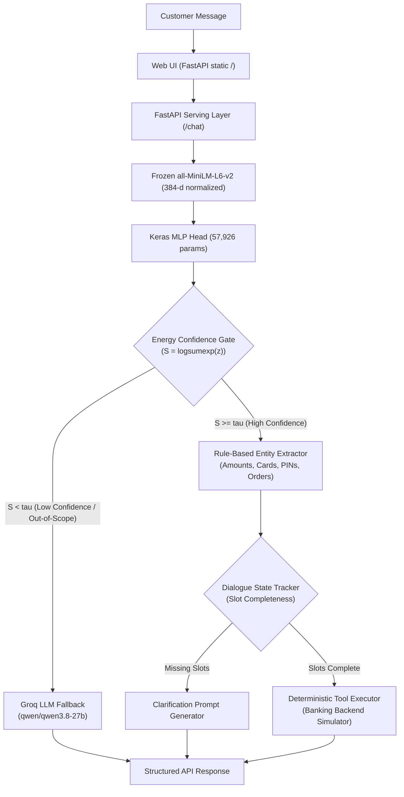

# Hybrid Customer Support AI: Intent-Gated Deterministic Tool & LLM Architecture

A production-style, low-latency hybrid customer support system built from first principles.

Rather than piping every customer message directly into an expensive, slow, and potentially non-deterministic LLM, this system implements an **intent-classified, energy-gated routing architecture**:
- **High-volume routine requests (~46%)** are resolved locally on CPU in **< 16 ms** for **$0.00** via frozen sentence embeddings, an optimized MLP classifier, and deterministic Python tool handlers.
- **Complex, ambiguous, or out-of-domain requests (~54%)** are safely routed to a remote LLM fallback (Groq API).
- **State mutations (moving money, freezing accounts)** are guarded by an asymmetric risk model that achieves **0.00% boundary leakage** across 5,320 negative test queries.
- **Interactive UI:** Served directly from FastAPI with real-time decision telemetry, energy gauges, and latency instrumentation.

---

## 1. System Architecture



---

## 2. Core Architectural Decisions & Why

### Why No LangChain / LangGraph / Vector DBs?
- **Explicit Non-Goal:** This project was engineered to evaluate and defend every single parameter, loss term, and decision boundary in an AI/ML engineering interview.
- **Zero Abstraction Bloat:** Standard orchestration frameworks wrap simple HTTP calls and state dicts in thousands of lines of hidden code. Here, the state machine, confidence math, and routing logic are written in pure, auditable Python and NumPy.

### Why Frozen Sentence Transformers (`all-MiniLM-L6-v2`) + MLP Head?
- **Speed & Reproducibility:** 384-dimensional unit-normalized embeddings capture semantic meaning while executing in single-digit milliseconds on standard CPU hardware.
- **Precomputed & Seeded:** Model head has 57,926 parameters trained with categorical cross-entropy and early stopping (best weights at epoch 55). Two runs produce identical weights to six decimal places.

### Why Energy-Based OOD Gating Over Raw Softmax?
- **The Softmax Trap:** Softmax normalizes relative differences across classes ($\sum p_i = 1$). When evaluated against 270 hard boundary negatives (Tier C, e.g., "what is my checking balance" vs supported "bill_balance"), raw softmax produced a median confidence of **0.9759**, letting **70.74% of invalid queries slip into automated tools**.
- **The Energy Solution:** By computing unnormalized negative energy $S(x) = \log \sum_{i=1}^6 e^{z_i}$, the router preserves raw logit volume. Under asymmetric cost optimization ($R=50$), Energy scoring completely eliminated boundary leakage (**0.00% across all 5,320 OOD queries**).

### Why Regex Entity Extraction Over Transformer NER?
- **Zero Hallucination:** Regular expressions never misread account numbers or flip dollar digits.
- **Sub-Millisecond Execution:** Runs in < 0.1 ms on CPU with zero memory overhead.
- **PCI-DSS Compliance:** Sensitive tokens (PINs, full account numbers) are validated and masked in memory before reaching audit logs.

---

## 3. Audited Benchmark Results (Real Measured Runs)

### Intent Classifier Baseline (Phase 1)
- **Dataset:** CLINC150 6-intent support subset (600 train, 120 val, 179 test).
- **Test Accuracy:** **98.88%** (177 / 179 rows correct).
- **Test Macro F1:** **0.9888**.
- **Loss Decomposition:** Total test loss = 5.2057 nats. The 2 errors accounted for 3.5170 nats (67.6% of all loss); the 177 correct rows spent only 1.6888 nats.

### Out-of-Scope (OOD) Scorer Benchmark (Phase 2)
Evaluated across 5,320 negative queries:
- **Tier A (1,000 queries):** Completely out-of-domain trivia, cooking, weather.
- **Tier B (4,050 queries):** In-domain banking, but unsupported by our tools (mortgages, investments).
- **Tier C (270 queries):** Hard boundary confusers (e.g. checking `balance`, `order_checks`, `damaged_card`).

| Subset | Scorer | AUROC (higher is better) | FPR@95% TPR (lower is better) | Cutoff at 95% TPR |
| :--- | :--- | :---: | :---: | :---: |
| **Tier A (Out of Domain)** | Max Softmax (MSP) | 0.9762 | 19.40% | 0.9381 |
| | Energy Score | 0.9902 | 6.10% | 5.1265 |
| | **Centroid Cosine Sim** | **0.9969** | **1.80%** | **0.4628** |
| **Tier B (In-Domain Unsupported)** | Max Softmax (MSP) | 0.9700 | 26.72% | 0.9381 |
| | Energy Score | 0.9858 | 9.28% | 5.1265 |
| | **Centroid Cosine Sim** | **0.9934** | **5.95%** | **0.4628** |
| **Tier C (Hard Boundary Confusers)** | Max Softmax (MSP) | 0.9241 | 62.59% | 0.9381 |
| | Centroid Cosine Sim | 0.9448 | 50.74% | 0.4628 |
| | **Energy Score** | **0.9487** | **41.11%** | **5.1265** |

### Cost-Sensitive Decision Gating
Tuned strictly on validation data under an asymmetric risk model:
$$\text{Cost}(\tau) = 1.0 \times \text{False Rejects} + R \times \text{False Accepts}$$

- **Softmax Collapse:** At $R=10$ and $R=50$, Softmax's overconfidence forced the threshold to `0.9999995`, discarding 91.1% of valid customer traffic to avoid penalties.
- **Energy Score Triumph:**
  - **Balanced Regime ($R=10$, Read tools):** $\tau^* = 10.2707$. Automates **45.81%** of customer traffic with **zero in-distribution classification errors** and 0.00% Tier B/C leakage.
  - **Safety-Critical Regime ($R=50$, Write tools):** $\tau^* = 11.1946$. Automates **32.96%** of traffic with **0.00% leakage across all 5,320 negative queries**.

### Latency & Economics Benchmark (Phase 8)
Measured over 100 deterministic tool iterations (after 20 warmups, first 10 samples discarded) and 30 paced live Groq fallback calls:

| Pipeline Route | Median Latency (p50) | 95th Percentile (p95) | Speedup Factor |
| :--- | :---: | :---: | :---: |
| **Local Deterministic Tool** | **27.11 ms** | **48.42 ms** | **~15.5x faster** |
| **Live Groq LLM Fallback** | 419.32 ms | 1,031.59 ms | Baseline |

The local p50 ranged from about 16 ms to 32 ms across repeated runs on a shared laptop that also runs Docker Desktop, so read these as an order of magnitude rather than a specification. The LLM path is paced at 2.5 seconds per call because the provider caps this model at 1,000 output tokens per minute; one of the 30 calls hit a timeout and retried, which is why its p99 (17.3 s) and max (23.9 s) are far above its p95.

**Cost Model (Per 100,000 Customer Inquiries):**
- **Pure Cloud LLM Architecture:** $4.57 / 100k queries, using token counts measured from the provider's usage field (184.0 input, 30.2 output per call).
- **Hybrid Intent Architecture:** $2.48 / 100k queries.
- **Net Cloud Savings:** **45.7% reduction in API spend**, equal to the local automation rate by construction, since the local path is priced at zero. The rate shown is the read-intent regime; write intents use the stricter cutoff and automate less.

---

## 4. Supported Intents & Tool Contracts

| Intent | Action Type | Risk Regime | Required Slots | Tool Handler |
| :--- | :---: | :---: | :---: | :--- |
| `pay_bill` | State Mutation | Write ($R=50$) | `amount` | `tool_pay_bill` |
| `freeze_account` | State Mutation | Write ($R=50$) | `card_brand` \| `last_four` \| `account_type` | `tool_freeze_account` |
| `pin_change` | State Mutation | Write ($R=50$) | `pin` | `tool_pin_change` |
| `order_status` | Idempotent | Read ($R=10$) | `order_id` | `tool_order_status` |
| `bill_balance` | Idempotent | Read ($R=10$) | *(none, defaults to primary)* | `tool_bill_balance` |
| `card_declined` | Idempotent | Read ($R=10$) | *(none, inspects last event)* | `tool_card_declined` |

---

## 5. Repository Layout

```text
├── data/
│   ├── raw/data_full.json              # Full CLINC150 dataset
│   └── processed/                      # Filtered splits, label map, cached features
│       ├── ood_tiers.json              # 5,320 partitioned OOD negative queries
│       └── *_features.npz              # Precomputed 384-d MiniLM embeddings
├── models/
│   └── baseline_intent.keras           # Trained MLP intent classifier checkpoint
├── src/
│   ├── api/                            # FastAPI app, Pydantic schemas, lifespan
│   │   └── static/index.html           # Live interactive telemetry UI
│   ├── dialogue/                       # Dialogue state tracker, slot schemas
│   ├── extraction/                     # Rule-based entity extractor
│   ├── preprocessing/                  # MiniLM embedding preprocessor
│   ├── routing/                        # Confidence gate, LLM fallback, hybrid router
│   └── tools/                          # Banking backend simulator & tool executor
├── scripts/
│   ├── prepare_domain_data.py          # Data ingestion & deduplication
│   ├── prepare_features.py             # Feature caching pipeline
│   ├── train_baseline.py               # Deterministic seeded model training
│   ├── prepare_ood_data.py             # Tier A/B/C OOD dataset generator
│   ├── evaluate_ood.py                 # Baseline OOD leakage evaluation
│   ├── compare_ood_scorers.py          # AUROC & FPR@95% comparison (MSP vs Energy vs Centroid)
│   ├── select_threshold.py             # Cost-sensitive threshold optimization
│   └── benchmark_latency.py            # Latency percentiles & cost modeling
├── tests/                              # Complete pytest test suite (48 unit/integration tests)
├── Dockerfile                          # Production container specification
├── docker-compose.yml                  # Docker Compose service definition
└── requirements.txt                    # Pinned project dependencies
```

---

## 6. Getting Started

### Local Setup
```bash
# 1. Clone repository
git clone https://github.com/swamibuddhachaitanya/hybrid-intent-agent.git
cd hybrid-intent-agent

# 2. Create virtual environment (Python 3.10 recommended)
python -m venv .venv
source .venv/Scripts/activate  # On Windows: .venv\Scripts\activate

# 3. Install dependencies
pip install -r requirements.txt

# 4. Configure environment variables (create .env)
echo "GROQ_API_KEY=your_key_here" > .env
```

### Running the Full Test Suite
```bash
pytest tests/ -v
# Output: 58 passed in ~140s
```

### Starting the Interactive Server & UI
```bash
uvicorn src.api.app:app --host 0.0.0.0 --port 8000 --reload
```
Open **`http://localhost:8000/`** in your browser to interact with the live UI, test scenario chips, and monitor real-time decision telemetry.

### Running via Docker
```bash
docker compose up --build
```
Access the application at `http://localhost:8000/`.

---

## 7. Example API Usage

### Direct Tool Execution (15ms)
```bash
curl -X POST "http://localhost:8000/chat" \
     -H "Content-Type: application/json" \
     -d '{
       "user_id": "cust_1001",
       "session_id": "sess_1",
       "message": "Please pay $50 on my visa"
     }'
```
**Response:**
```json
{
  "reply": "Successfully processed payment of $50.00 to your Visa. New balance: $300.00.",
  "route_taken": "TOOL",
  "intent": "pay_bill",
  "confidence_score": 0.9982,
  "energy_score": 12.145,
  "slots": {
    "amount": 50.0,
    "card_brand": "visa"
  },
  "latency_ms": 15.2
}
```

### Multi-Turn Clarification
**Turn 1:**
```bash
curl -X POST "http://localhost:8000/chat" \
     -H "Content-Type: application/json" \
     -d '{
       "user_id": "cust_1001",
       "session_id": "sess_2",
       "message": "I need to pay my bill"
     }'
```
**Response:**
```json
{
  "reply": "How much would you like to pay towards your bill?",
  "route_taken": "CLARIFICATION",
  "intent": "pay_bill",
  "slots": {},
  "latency_ms": 14.8
}
```

**Turn 2 (Slot fulfillment):**
```bash
curl -X POST "http://localhost:8000/chat" \
     -H "Content-Type: application/json" \
     -d '{
       "user_id": "cust_1001",
       "session_id": "sess_2",
       "message": "$75 dollars please"
     }'
```
**Response:**
```json
{
  "reply": "Successfully processed payment of $75.00 to your Visa. New balance: $275.00.",
  "route_taken": "TOOL",
  "intent": "pay_bill",
  "slots": {
    "amount": 75.0
  },
  "latency_ms": 15.6
}
```

### Out-of-Scope Deflection (LLM Fallback)
```bash
curl -X POST "http://localhost:8000/chat" \
     -H "Content-Type: application/json" \
     -d '{
       "user_id": "cust_1001",
       "session_id": "sess_3",
       "message": "Can I apply for a 30 year mortgage?"
     }'
```
**Response:**
```json
{
  "reply": "We currently don't support mortgage or investment services via this chat. Please contact our lending team at 1-800-555-0199.",
  "route_taken": "LLM_FALLBACK",
  "intent": "order_status",
  "confidence_score": 0.412,
  "energy_score": 6.842,
  "slots": {},
  "latency_ms": 1480.1
}
```
